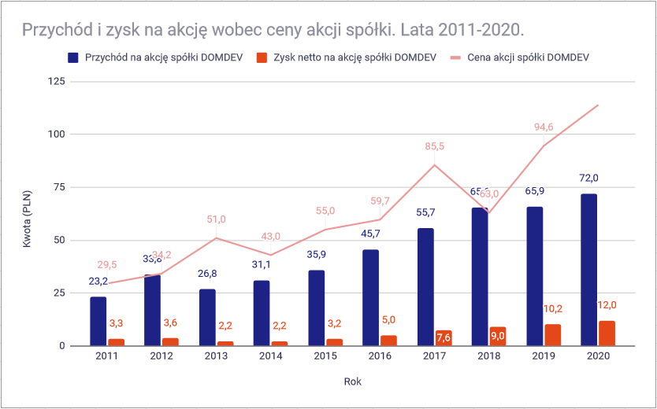
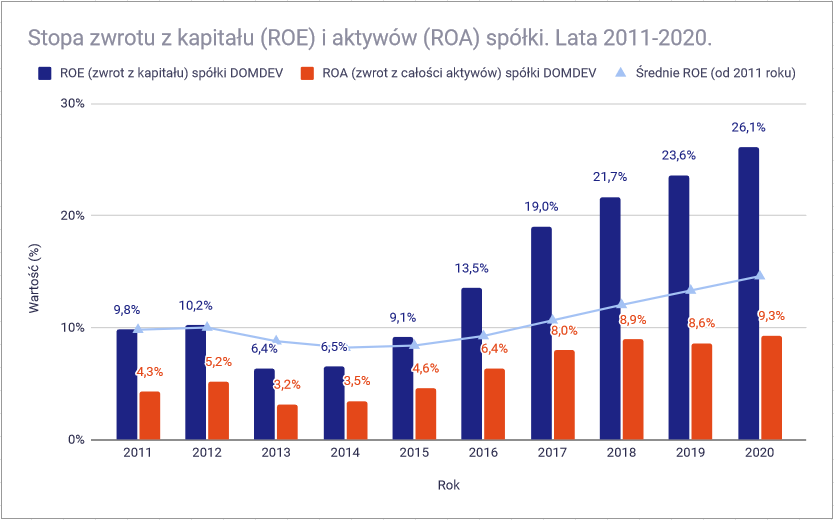
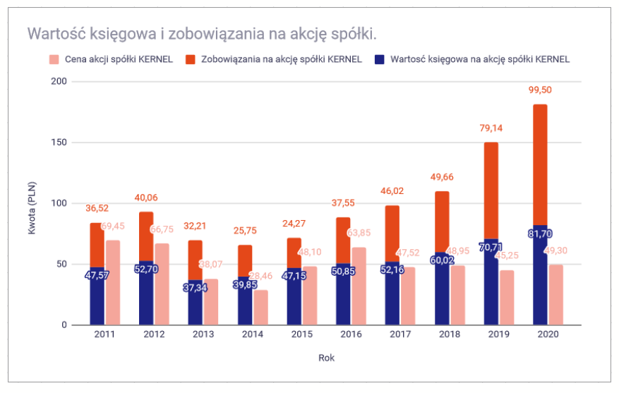
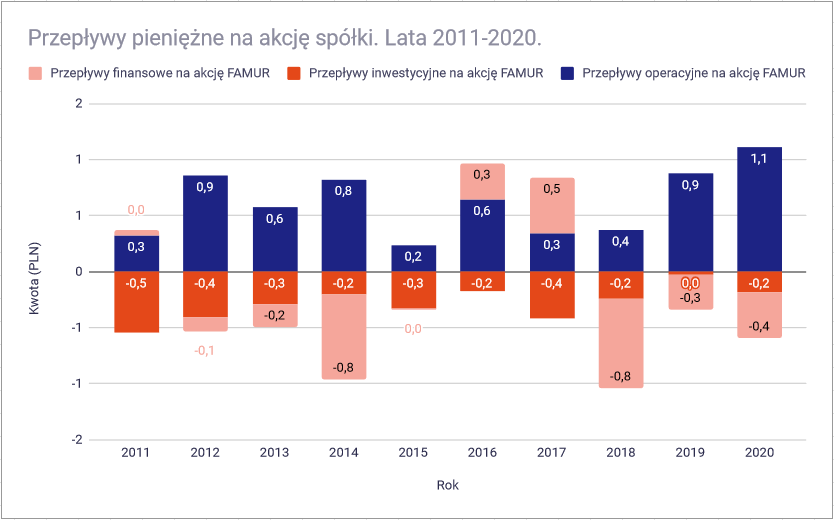
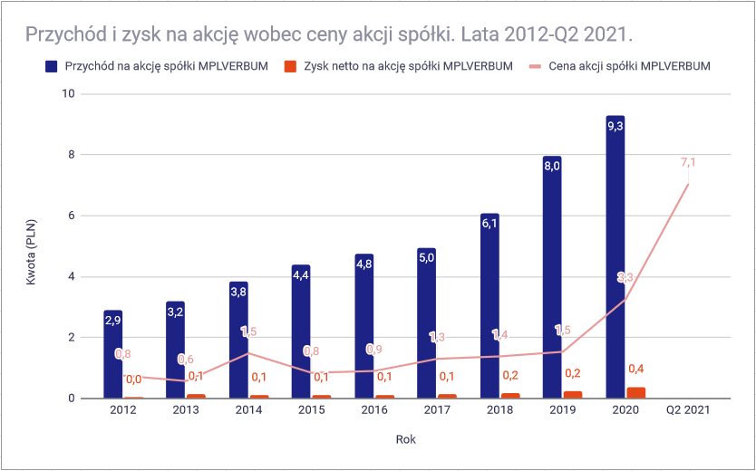

# Analiza fundamentalna spółek giełdowych - przewodnik praktyczny

_Wersja robocza - usystematyzowane notatki_

---

## 📑 Spis treści

### 1. CZĘŚĆ I: Podstawy analizy fundamentalnej
- [1.1. Wprowadzenie](#11-wprowadzenie)

### 2. CZĘŚĆ II: Sprawozdania finansowe - jak je czytać
- [2.1. Wprowadzenie do sprawozdań finansowych](#21-wprowadzenie-do-sprawozdań-finansowych)
- [2.2. Rachunek zysków i strat (RZiS)](#22-rachunek-zysków-i-strat-rzis)
- [2.3. Bilans](#23-bilans)
- [2.4. Rachunek przepływów pieniężnych (Cash Flow)](#24-rachunek-przepływów-pieniężnych-cash-flow)

### 3. CZĘŚĆ III: Wskaźniki finansowe
- [3.1. Wskaźniki rentowności](#31-wskaźniki-rentowności)
- [3.2. Wskaźniki płynności finansowej](#32-wskaźniki-płynności-finansowej)
- [3.3. Wskaźniki zadłużenia i wypłacalności](#33-wskaźniki-zadłużenia-i-wypłacalności)
- [3.4. Wskaźniki cenowe/giełdowe](#34-wskaźniki-cenowegiełdowe)
- [3.5. Wskaźniki dywidendowe](#35-wskaźniki-dywidendowe)

### 4. CZĘŚĆ IV: Analiza Fundamentalna
- [4.1. Analiza firm typu Value](#41-analiza-firm-typu-value)
- [4.2. Analiza firm typu Growth](#42-analiza-firm-typu-growth)

---

# 1. CZĘŚĆ I: Podstawy analizy fundamentalnej

## 1.1. Wprowadzenie

Celem dokumentu jest uporządkowanie kroków analizy spółki giełdowej i zrozumienie podstawowych elementów sprawozdań finansowych.

**Analiza wstępna (biznes i branża)**

Sprawdź:

- czym zajmuje się spółka (model biznesowy, źródła przychodów),
- w jakiej działa branży,
- czy branża się rozwija i ma perspektywy wzrostu.

**Szybki checklist**

- Przychody i zysk: rosną czy falują?
- Marża operacyjna: stabilna czy spada?
- CFO: dodatni i zbliżony do zysku netto?
- Dług netto: rośnie szybciej niż biznes?
- Należności / zapasy: rosną szybciej niż sprzedaż?
- Dywidenda: z gotówki czy na kredyt?

---

# 2. CZĘŚĆ II: Sprawozdania finansowe - jak je czytać

## 2.1. Wprowadzenie do sprawozdań finansowych

**Elementy sprawozdania i sens dla inwestora**

Poniższa tabela pokazuje, co zawiera każda część sprawozdania i na co patrzeć jako inwestor.

| Część sprawozdania | Co w niej znajdziesz (w skrócie) | Po co to inwestorowi / na co patrzeć |
| --- | --- | --- |
| Bilans (Sytuacja finansowa) | Aktywa (majątek: gotówka, należności, zapasy, środki trwałe) oraz pasywa (kapitał własny + zobowiązania) - stan na dzień | Bezpieczeństwo i stabilność: zadłużenie, płynność, jakość aktywów (np. czy rosną należności/zapasy), struktura finansowania |
| Rachunek zysków i strat (RZiS) | Przychody, koszty, wynik operacyjny, finansowy, podatek, zysk netto - za okres | Rentowność i wzrost: marże, tempo wzrostu, czy zysk jest powtarzalny, udział kosztów stałych/zmiennych |
| Rachunek przepływów pieniężnych (Cash Flow) | Przepływy: operacyjne (CFO), inwestycyjne (CFI), finansowe (CFF) - za okres | Prawdziwa gotówka vs papierowy zysk: czy zysk zamienia się w CFO, CAPEX vs amortyzacja, dywidendy i spłaty długu z realnej gotówki |
| Zmiany w kapitale własnym | Jak zmienił się kapitał: zysk zatrzymany, dywidendy, emisje/wykupy akcji, inne korekty | Polityka dla akcjonariuszy: czy firma buduje kapitał, czy rozwadnia, czy dywidenda jest zdrowa |
| Noty objaśniające (Informacja dodatkowa) | Szczegóły pozycji z bilansu/RZiS/CF, zasady rachunkowości, segmenty, zadłużenie (terminy, oprocentowanie), rezerwy, spory, transakcje powiązane | Największe mięso: tu wychodzą jednorazówki, ryzyka, kowenanty, manipulacje rachunkowe i to, co naprawdę siedzi w liczbach |
| Opinia biegłego rewidenta (audyt) | Typ opinii (bez zastrzeżeń / z zastrzeżeniem / odmowa / negatywna), kluczowe sprawy badania (KAM) | Czerwona lampka lub zielone światło: zastrzeżenia, problemy z kontynuacją działalności, obszary ryzyka wskazane przez audytora |
| Sprawozdanie z działalności / raport zarządu (często razem) | Opis biznesu, ryzyk, otoczenia, perspektyw, komentarz do wyników, inwestycje | Kontekst i narracja: weryfikujesz, czy opowieść zarządu pasuje do liczb; szukasz konkretów zamiast marketingu |

**Zalecana kolejność czytania raportu**

1. RZiS - czy rośnie biznes i marże?
2. Cash Flow - czy zysk zamienia się w gotówkę?
3. Bilans - czy nie rośnie dług / zapasy / należności podejrzanie?
4. Noty - zadłużenie, jednorazowe zdarzenia, segmenty, ryzyka.
5. Kapitał własny + raport zarządu - kontekst i jakość zarządzania.

**Terminy publikacji raportów (GPW - standardowe terminy)**

- Raport roczny - do 30 kwietnia.
- Raport za I kwartał - do 31 maja.
- Raport półroczny - do 30 września.
- Raport za III kwartał - do 30 listopada.

---

## 2.2. Rachunek zysków i strat (RZiS)

Uproszczona logika RZiS - układ zbliżony do sprawozdania finansowego (od góry do dołu rachunku):

| Poziom | Pozycja RZiS | Wpływ na wynik | Znaczenie dla inwestora |
| --- | --- | --- | --- |
| 1 | Przychody ze sprzedaży netto | + | Sprzedaż usług, wyrobów i towarów po potrąceniu VAT. Punkt startowy do oceny skali biznesu. |
| 2 | Koszty wytworzenia sprzedanych wyrobów | - | Koszty bezpośrednio związane z produkcją/świadczeniem usług (materiały, energia, wynagrodzenia produkcyjne, usługi obce, amortyzacja). |
| 3 | **Zysk/strata na sprzedaży (brutto)** | = | Pierwszy kluczowy poziom rentowności podstawowej działalności. |
| 4 | Koszty ogólnego zarządu | - | Koszty utrzymania organizacji. |
| 5 | Koszty sprzedaży | - | Koszty związane z pozyskaniem i obsługą sprzedaży. |
| 6 | **Zysk/strata na sprzedaży (netto)** | = | Faktyczny wynik na kluczowej działalności operacyjnej przed pozostałą działalnością operacyjną. |
| 7 | Pozostałe przychody operacyjne | + | Dodatkowe przychody operacyjne (np. dotacje, sprzedaż aktywów). |
| 8 | Pozostałe koszty operacyjne | - | Dodatkowe koszty operacyjne (np. kary, odszkodowania, odpisy). |
| 9 | **Zysk/strata na działalności operacyjnej (EBIT)** | = | Kluczowy wynik operacyjny firmy przed finansowaniem i podatkiem. |
| 10 | Przychody finansowe | + | Dywidendy, odsetki, zyski ze zbycia aktywów finansowych. |
| 11 | Koszty finansowe | - | Koszt odsetek i innych operacji finansowych. |
| 12 | **Zysk/strata brutto** | = | Wynik przed opodatkowaniem. |
| 13 | Podatek dochodowy | - | Obciążenie podatkowe okresu. |
| 14 | **Zysk/strata netto** | = | Wynik końcowy po podatku, baza m.in. do oceny dywidendy i akumulacji kapitału. |

---

## 2.3. Bilans

### 2.3.1. Aktywa - słownik pojęć

Najważniejsze pozycje po stronie aktywów i ich znaczenie:

| Pozycja | Wyjaśnienie |
| --- | --- |
| Aktywa | Zasoby majątkowe jednostki finansowane pasywami. |
| **Aktywa trwałe** | Aktywa o ekonomicznej przydatności dłuższej niż 1 rok. |
| Wartości niematerialne i prawne | Prawa majątkowe, koszty zakończonych prac rozwojowych i tzw. goodwill, czyli wartość marki. |
| Rzeczowe aktywa trwałe | Aktywa trwałe posiadające materialną formę: grunty, budynki, urządzenia, środki transportu. |
| Należności długoterminowe | Należności, których termin wymagalności jest dłuższy niż 1 rok (nie wliczając należności z tytułu dostaw i usług). |
| Inwestycje długoterminowe | Nieruchomości, akcje, obligacje i pożyczki, które nabyte zostały w celu osiągnięcia korzyści ekonomicznej w okresie dłuższym niż 1 rok. |
| Długoterminowe rozliczenia okresowe | Np. aktywa z tytułu odroczonego podatku dochodowego. |
| **Aktywa obrotowe** | Aktywa o ekonomicznej przydatności krótszej niż 1 rok. |
| Zapasy | Materiały, produkty w toku, produkty gotowe i towary, czyli składniki używane do produkcji, jak i te na handel. |
| Należności krótkoterminowe | Wszystkie należności z tytułu dostaw i usług oraz inne, których termin wymagalności jest krótszy niż 1 rok. |
| Inwestycje krótkoterminowe | Gotówka i inne inwestycje krótkoterminowe (lokaty, pożyczki i obligacje do 1 roku itp.). |
| Krótkoterminowe rozliczenia międzyokresowe | Wartość opłaconych z góry środków pieniężnych na koszty podlegające kolejnemu okresowi sprawozdawczemu. |

### 2.3.2. Pasywa - słownik pojęć

Najważniejsze pozycje po stronie pasywów i ich znaczenie:

| Pozycja | Wyjaśnienie |
| --- | --- |
| **Pasywa** | Prawa majątkowe właścicieli i innych podmiotów do aktywów jednostki. **Ludzkim językiem:** sposób finansowania aktywów. |
| **Kapitał własny** | Równowartość aktywów sfinansowana ze środków właścicieli. |
| - Kapitał podstawowy | Pierwotny wkład właścicieli przy założeniu spółki gospodarczej + kapitał z emisji nowych akcji, ale do ich wartości nominalnej. |
| - Kapitał zapasowy | Należy go zwiększać, dopóki nie osiągnie przynajmniej 1/3 kapitału zakładowego (założycielskiego). Zwiększa go nadwyżka wartości wyemitowanych udziałów nad ich wartością nominalną. |
| - Kapitał z aktualizacji wyceny | Zmiana wartości środków trwałych, inwestycji finansowych oraz efekt sprzedanych lub zlikwidowanych środków trwałych. |
| - Pozostałe kapitały rezerwowe | Np. przeznaczenie kapitału na przyszłe dywidendy. |
| - Wynik finansowy z lat ubiegłych | Zysk/straty z poprzedniego okresu, co do których właściciele nie podjęli decyzji o ich rozdysponowaniu. |
| - Wynik finansowy z bieżącego roku | Wartość wyniku zgodnie z rachunkiem zysków i strat. |
| **Zobowiązania** | Równowartość aktywów sfinansowana ze środków zewnętrznych. |
| - Rezerwy na zobowiązania | Np. odroczony podatek dochodowy czy zobowiązania emerytalne. |
| - Zobowiązania długoterminowe | Kredyty i pożyczki, obligacje i inne zobowiązania powyżej 1 roku. |
| - Zobowiązania krótkoterminowe | Kredyty i pożyczki, obligacje i inne zobowiązania poniżej 1 roku. |
| - Rozliczenia międzyokresowe | Np. ujemna wartość firmy, gdy firma kupuje inną firmę poniżej jej wartości godziwej (np. wartości aktywów po cenie rynkowej). |

---

## 2.4. Rachunek przepływów pieniężnych (Cash Flow)

### 2.4.1. Pozycje i znaczenie

Najważniejsze sekcje rachunku przepływów pieniężnych i ich interpretacja:

| Pozycja | Wyjaśnienie |
| --- | --- |
| **Przepływy pieniężne z działalności operacyjnej** | Ile gotówki spółka zyskała/straciła na swojej głównej działalności w danym okresie sprawozdawczym. |
| Zakres działalności operacyjnej | Podstawowy rodzaj działalności jednostki oraz inne rodzaje działalności niezaliczone do inwestycyjnej lub finansowej. |
| **Przepływy pieniężne z działalności inwestycyjnej** | Ile gotówki spółka zainwestowała (-) lub uzyskała ze zbycia inwestycji (+). |
| Zakres działalności inwestycyjnej | Nabywanie i zbywanie składników aktywów trwałych i krótkoterminowych aktywów finansowych oraz związane z nimi koszty i korzyści. |
| **Przepływy pieniężne z działalności finansowej** | Ile gotówki spółka pozyskała z emisji akcji, obligacji lub zaciągnięcia długu (+), albo ile długu spłaciła (-). |
| Zakres działalności finansowej | Pozyskiwanie lub utrata źródeł finansowania oraz związane z nimi pieniężne koszty i korzyści. |

### 2.4.2. Ocena matrycy przepływów (znaki)

Najpierw patrz na znak przepływów operacyjnych (CFO), a potem oceniaj układ razem z CFI i CFF. Układ `+ - -` bywa zdrowy, natomiast `- + +` często sygnalizuje problemy z podstawową działalnością.

| Nr | Sytuacja | CFO (operacyjna) | CFI (inwestycyjna) | CFF (finansowa) |
| --- | --- | --- | --- | --- |
| 1 | Firma gromadzi środki pieniężne na koncie, aby przeznaczyć je na przyszłe inwestycje. | + | + | + |
| 2 | Idealna sytuacja - firma zarabia, inwestuje i spłaca zobowiązania. | + | - | - |
| 3 | Firma zarabia, inwestuje, ale pozyskuje dodatkowe finansowanie zewnętrzne. | + | - | + |
| 4 | Firma zarabia, ale sprzedaje aktywa (dezinwestuje) i reguluje zobowiązania. | + | + | - |
| 5 | Ujemne przepływy operacyjne, ale firma sprzedaje aktywa i pozyskuje środki z finansowania. Może świadczyć o przejściowych trudnościach. | - | + | + |
| 6 | Niedobory gotówkowe przedsiębiorstwa są pokrywane ze sprzedaży aktywów, co może oznaczać przyszłe bankructwo. | - | + | - |
| 7 | Sytuacja typowa dla młodych, rozwijających się firm, które jeszcze nie osiągnęły rentowności i dużo inwestują. | - | - | + |
| 8 | Przedsiębiorstwo inwestuje mimo notowania strat i konieczności regulowania wcześniejszych zobowiązań. | - | - | - |

---

# 3. CZĘŚĆ III: Wskaźniki finansowe

## 3.1. Wskaźniki rentowności

**ROE** (Return on Equity) - stopa zwrotu z kapitału własnego lub rentowność kapitału własnego - w przedsiębiorczości, wskaźnik rentowności oznaczający jak wiele zysku udało się wygospodarować spółce z wniesionych kapitałów własnych. Im wartość tego wskaźnika jest wyższa, tym korzystniejsza jest sytuacja firmy. Wyższa efektywność kapitału własnego wiąże się z możliwością uzyskania wyższej nadwyżki finansowej, a co za tym idzie wyższych dywidend.

$$
ROE = \frac{net\ profit}{equity}\cdot 100\%
$$

**ROA** (Return on Assets) - wskaźnik rentowności aktywów. ROA to stosunek zysku netto spółki do wartości jej aktywów. Może być też obliczany jako iloczyn rentowności sprzedaży oraz wskaźnika obrotu aktywów. Informuje o zdolności spółki do wypracowywania zysków i efektywności % gospodarowania jej majątkiem. Im wyższy jest wskaźnik ROA, tym lepsza jest kondycja finansowa spółki. Wskaźnik istotny m.in. dla instytucji finansowych rozważających udzielenie kredytu i badających możliwości jego spłaty.

$$
ROA = \frac{net\ profit}{total\ assets}\cdot 100\%
$$

**ROS** (Return on Sales) - wskaźnik rentowności sprzedaży, rentowność netto - wskaźnik rentowności oznaczający, jak wiele zysku netto pozostaje w przedsiębiorstwie ze sprzedaży. Wskaźnik rentowności sprzedaży to stosunek zysku netto do przychodów netto ze sprzedaży. Informuje o tym ile procent sprzedaży stanowi marża zysku po odliczeniu wszystkich kosztów i zapłaceniu podatków. Wyższy poziom tego wskaźnika wskazuje na korzystniejszą kondycję finansową przedsiębiorstwa. Pogorszenie wskaźnika oznacza, że przedsiębiorstwo musi zrealizować większe rozmiary.

$$
ROS = \frac{net\ profit}{net\ sales}\cdot 100\%
$$

---

## 3.2. Wskaźniki płynności finansowej

**Cash Ratio** - wskaźnik płynności gotówkowej. Określa, ile razy środki pieniężne będące w dyspozycji przedsiębiorstwa (w kasie lub na rachunku bankowym) pokrywają jego bieżące zobowiązania wobec osób trzecich. Optymalna wysokość tego wskaźnika wynosi 0,2. Wskaźnik ten nie odgrywa istotnej roli przy ustalaniu płynności przedsiębiorstwa, ponieważ w myśl reguł zarządzania finansami, środki pieniężne powinny być ograniczone do minimum, gdyż tylko aktywa zaangażowane w obrocie generują wynik finansowy.

$$
Cash\ Ratio = \frac{cash}{current\ liabilities}
$$

**QR** (Quick Ratio) - wskaźnik płynności szybkiej. Określa, ile razy aktywa bieżące o wysokim stopniu płynności, będące w dyspozycji przedsiębiorstwa, pokrywają jego bieżące zobowiązania wobec osób trzecich. Wskaźnik ten jest wobec wskaźnika CR skorygowany o najmniej płynne aktywa obrotowe, tj. zapasy i rozliczenia międzyokresowe czynne. Optymalna wysokość tego wskaźnika powinna wynosić 1,0, tj. pasywa bieżące powinny być w całości pokryte aktywami bieżącymi o wysokim stopniu płynności. W przypadku przedsiębiorstw charakteryzujących się szybką rotacją aktywów (np. handlowych) norma ta jest obniżona do poziomu 0,7. Niska wartość tego wskaźnika może świadczyć o problemach w zakresie płynności, wysoka zaś o nieproduktywnym nagromadzeniu środków pieniężnych i/lub występowaniu wysokiego stanu należności, co może mieć niekorzystny wpływ na wyniki przedsiębiorstwa.

$$
QR = \frac{current\ assets - inventory - prepayments}{current\ liabilities}
$$

**CR** (Current Ratio) - wskaźnik płynności bieżącej. Informuje o zdolności firmy do wywiązywania się z bieżących zobowiązań, gdyż wskazuje na to, w jakim stopniu majątek obrotowy może pokryć bieżące zobowiązania. Wskaźnik powinien przyjmować wartość w granicach 1,3 - 2. Za optymalną wielkość banki często przyjmują wskaźnik na poziomie równym 2.

$$
CR = \frac{current\ assets}{current\ liabilities}
$$

---

## 3.3. Wskaźniki zadłużenia i wypłacalności

**DR** (Debt Ratio) - wskaźnik ogólnego zadłużenia. Wskaźnik finansowy stanowiący stosunek kapitałów obcych (zobowiązań) do aktywów. Wskaźnik ogólnego zadłużenia jest najbardziej ogólnym obrazem struktury finansowania aktywów przedsiębiorstwa. Im większa jest wartość tego wskaźnika tym wyższe ryzyko ponosi kredytodawca. Stąd często przyjmuje się, że jego wartość powyżej 0,67 wskazuje na nadmierne ryzyko kredytowe. Niski poziom wskaźnika świadczy o samodzielności finansowej przedsiębiorstwa. Przyjęty punkt odniesienia (norma) nie oznacza optymalnej struktury finansowania. Ta zależna jest m.in. od kosztu pozyskania kapitału, a także od generowanej stopy zwrotu (rentowności ekonomicznej, wskaźnika rentowności aktywów) przez przedsiębiorstwo.

$$
DR = \frac{total\ liabilities}{total\ assets}
$$

**D/E** (Debt to Equity Ratio) - wskaźnik informujący o poziomie zadłużenia kapitałów własnych przedsiębiorstwa i zarazem relację kapitałów obcych do kapitałów własnych jako źródeł finansowania przedsiębiorstwa. Przyjmuje się, że wielkość tego wskaźnika nie powinna być wyższa niż 1,0 dla przedsiębiorstw dużych i średnich oraz 3,0 dla przedsiębiorstw małych.

$$
Debt\ to\ Equity = \frac{debt}{equity}
$$

**ICR** (Interest Coverage Ratio) - wskaźnik pokrycia odsetek. Określa, ile razy zysk operacyjny (EBIT) spółki pokrywa koszty z tytułu odsetek od zadłużenia. Im wyższa wartość wskaźnika, tym łatwiej spółce regulować zobowiązania odsetkowe bez zagrożenia dla płynności. Wartość powyżej 3 zazwyczaj wskazuje na bezpieczny poziom, natomiast spadek poniżej 1,5 to wyraźny sygnał ostrzegawczy i rosnące ryzyko niewypłacalności.

$$
ICR = \frac{EBIT}{interest\ expense}
$$

---

## 3.4. Wskaźniki cenowe/giełdowe

**P/E** (Price/Earnings Ratio) - wskaźnik cena/zysk. Jest stosunkiem rynkowej ceny akcji do zysku netto spółki. Niski poziom wskaźnika może sugerować, że inwestycja jest korzystna, ponieważ firma osiąga spore zyski, przy relatywnie niskiej wycenie rynkowej. Zbyt niski jego poziom sygnalizuje, że akcje spółki są niedowartościowane i zachęca do taniego ich nabycia. W praktyce zbyt duża wartość C/Z może świadczyć o dużym entuzjazmie inwestorów lub o spekulacji dużych inwestorów. Wskaźnik C/Z powinien być porównywany ze wskaźnikiem branżowym i wyznaczonym dla innych spółek, lub do wskaźnika tej samej spółki w przeszłości. Porównując C/Z firm z tej samej branży, można spodziewać się, że akcje spółki o wysokim poziomie C/Z są przewartościowane i ich kurs może w najbliższym czasie spaść.

$$
P/E = \frac{share\ price}{earnings\ per\ share\ (EPS)}
$$

**CAPE** (Cyclically Adjusted P/E) - cyklicznie dostosowany wskaźnik cena/zysk. Wariant C/Z, w którym zamiast zysku z ostatnich 4 kwartałów pod uwagę bierzemy średni zysk z ostatnich 10 lat dla indeksu lub spółki. Niezwykle zyskał on na popularności jako ten „bardziej obiektywny" i mniej podatny na chwilowe skoki lub dołki w zysku, który notuje spółka. Jest fatalny dla spółek wzrostowych. Stosować do spółek Value i które są stabilne.

$$
CAPE = \frac{share\ price}{average\ real\ EPS\ over\ 10\ years}
$$

**P/BV** (Price to Book Value) - wskaźnik cena do wartości księgowej. Pokazuje relację kapitalizacji giełdowej (ceny rynkowej) do wartości księgowej spółki. Wartość poniżej 1 może sugerować niedowartościowanie.

$$
P/BV = \frac{market\ capitalization}{book\ value}
$$

---

## 3.5. Wskaźniki dywidendowe

**DPR** (Dividend Payout Ratio) - stopa wypłaty dywidendy. Wskaźnik, który liczymy, dzieląc kwotę wypłacanej dywidendy przez zysk netto z poprzedniego okresu sprawozdawczego (zwykle poprzedniego roku, bo głównie z niego wypłaca się dywidendy). Im wyższy, tym bardziej „serio" firma podchodzi do wypłacania dywidend lub tym mniej pomysłu ma na pożytkowanie zarobionej gotówki w przedsiębiorstwie.

$$
DPR = \frac{total\ dividend}{net\ profit}\cdot 100\%
$$

**DY** (Dividend Yield) - stopa dywidendy. Wskaźnik, który uzyskujemy dzieląc kwotę wypłacanej dywidendy na akcję przez cenę akcji. Zwykle w granicach 2-6% oznacza to ile dywidendy „wycisnęlibyśmy" kupując akcje spółki po obecnej cenie. Im więcej, tym lepiej, ale rzadko zdarzają się okazje typu 10% i więcej.

$$
DY = \frac{dividend\ per\ share}{share\ price}\cdot 100\%
$$

---

# 4. CZĘŚĆ IV: Analiza Fundamentalna

## 4.1. Analiza firm typu Value

| KRYTERIUM | GRAHAM | Adaptacja na GPW |
| --- | --- | --- |
| Wielkość | 50 mln USD majątku firmy (w 1949). Dziś byłoby to około 500 mln majątku (po uwzględnieniu inflacji). | Obniżamy wymaganie do 300 mln zł kapitału własnego (ze względu na specyfikę i wielkość GPW). |
| Kondycja finansowa | Wskaźnik płynności bieżącej (CR) > 2. | Wskaźnik płynności bieżącej (CR) > 2. |
| Stabilność zysków | Zysk w 10 ostatnich latach. | Obecne ROE > 5% i brak strat w ostatnich 5 latach. |
| Rejestr dywidend | 20 lat stałego wypłacania dywidend. | Brak twardego kryterium, ale doceniany jest powtarzalny proces wypłaty z FCF. |
| Wzrost dochodów | Wzrost średniego zysku o przynajmniej 33% w ciągu dekady. | Opcjonalnie w pierwszej fazie, u Grahama dynamika nie jest kluczowa. |
| Umiarkowana cena wobec wyników | CAPE < 15. | C/Z < 10. |
| Umiarkowana cena wobec wartości | C/WK < 1,5. | C/WK < 3. |

**Plan analizy value investing (3 etapy):**

1. **Etap 1: Skan i wstępna selekcja spółek** — automatyczny screening.
2. **Etap 2: Wstępna analiza historyczna** — weryfikacja trendów z 5-10 lat: zyskowność, fundamenty, wycena.
3. **Etap 3: Analiza jakościowa** — głęboka ocena biznesu, zarządu, fosy (moat), ryzyk i katalizatorów wzrostu.

---

### Etap 1: Skan i wstępna selekcja spółek

#### Parametry screenera

| Kryterium | Wartość graniczna | Uzasadnienie |
| --- | --- | --- |
| **Kapitał własny** | > 300 mln PLN | Wielkość — firma stabilna, płynność akcji, dostępność raportów. |
| **Current Ratio (CR)** | > 2,0 | Kondycja finansowa — płynność bieżąca. Firma z łatwością pokrywa zobowiązania krótkoterminowe. |
| **Cena/Wartość księgowa (P/BV)** | < 1,5 | Nie przepłacamy za majątek netto. |
| **Cena/Zysk (P/E)** | < 10 | Niska wycena względem bieżących zysków. |
| **ROE** | > 5% | Stabilność zysków — omijamy pułapki wartości (value traps), spółka musi efektywnie zarabiać na własnym kapitale. |

---

### Etap 2: Wstępna analiza historyczna (eliminacja)

Celem tego etapu jest szybkie odrzucenie spółek niespełniających kluczowych kryteriów przed przejściem do czasochłonnej analizy jakościowej. Zgodnie z planem analizy dokonujemy weryfikacji w trzech głównych filarach.

#### 1. Zyskowność
*Czy firma rośnie i generuje realną gotówkę?*
- [ ] **Rosnące przychody historyczne:** *Revenue, Revenue Growth YoY, Revenue Estimates for n-next years*
- [ ] **Rosnące prognozy przychodów:** *Revenue Estimated Growth* + rewizje prognoz w górę
- [ ] **Rosnące zyski historyczne:** *EPS, EPS Growth YoY, EPS Estimates for n-next years*
- [ ] **Rosnące prognozy zysków:** *EPS Estimated Growth* + rewizje prognoz w górę
- [ ] **Pozytywny Cash-Flow:** *CFO*, *Net Income*, *Operating Margin*

#### 2. Fundamenty
*Czy firma jest bezpieczna finansowo i efektywnie zarządza kapitałem?*
- [ ] **Current/Quick Ratio:** > 1 i rośnie (bezpieczna płynność bieżąca, zdolność do spłaty długów w krótkim terminie).
- [ ] **Debt to Assets:** < 35% (akceptowalny poziom zadłużenia do majątku - większość to kapitał własny).
- [ ] **Debt to Equity:** < 1,0 (bezpieczna dźwignia finansowa).
- [ ] **Interest Coverage:** > 3,0 i rośnie (zyski operacyjne bezpiecznie pokrywają koszty odsetek).
- [ ] **Rentowność:** ROE > 10-15%, ROA > 5% (na stabilnym lub rosnącym poziomie).
- [ ] **Bezpieczeństwo bazowe:** Ohlson-Score < 0,5

#### 3. Wycena
*Czy nie przepłacamy względem historycznych mnożników i czy mamy margines bezpieczeństwa?*
- [ ] **P/E:** < mediana 3y.
- [ ] **P/S:** < mediana 5y.
- [ ] **P/FCF:** < mediana 3y.
- [ ] **P/BV:** < mediana 3y.
- [ ] **Upside:** > 20% do wyceny wewnętrznej < mediana.

---

#### Krok 2.1: Zyskowność — zarabianie pieniędzy, dynamika, rozwój

**Przykład dobrej spółki — przychód i zysk na akcję wobec ceny akcji:**

**Przykład dobrej spółki — ROE i ROA:**

---

#### Krok 2.2: Fundamenty — bezpieczeństwo finansowe (płynność, dług, przepływy)
**Pytanie kluczowe:** Czy firma jest stabilna finansowo i potrafi spłacać długi z operacyjnej gotówki?

| Wskaźnik | Co sprawdzamy | Interpretacja | Sygnał pozytywny |
| --- | --- | --- | --- |
| **Zobowiązania na akcję (Liabilities/Share)** | Trend zadłużania per akcja | Pozwala błyskawicznie wychwycić, w jakim stopniu działalność spółki jest napędzana rosnącym cudzym kapitałem. W przypadku "Value" silnie pożądana jest powolna ewolucja bez nakręcania luki kredytowej. | Stabilne lub malejące zobowiązania p/s |
| **Relacja BVPS do Zobowiązań p/s** | Budowa majątku względem długu | Zestawienie Wartości księgowej na akcję (BVPS) i Zobowiązań. | BVPS konsekwentnie rośnie szybciej niż linia zobowiązań |
| **Struktura Przepływów (Cash Flow)** | Jak gotówka rzeźbi biznes | Zysk giełdowy (EPS) to zapis księgowy oparty o marże, ale to gotówka (Cash) pozwala przetrwać zimę. Patrzysz, czy rosnący biznes nie "spala gotówki". | Układ operacyjnej, dojrzałej Value: `+ - -` (Zarabia, Reinwestuje, Oddaje dług/dywidendę). |

**Przykład neutralnej spółki:**

---

#### Krok 2.3: Wycena — czy spółka jest historycznie tania?

**Przykład neutralnej spółki:**

---

### Etap 3: Analiza jakościowa (Due Diligence)

**Cel:** Odsianie pozornie tanich spółek (value traps), zrozumienie anomalii z Etapu 2 i ocena redukcji ryzyka. Szukamy odpowiedzi na pytanie: *Dlaczego rynek wycenia tę spółkę tak tanio?*

#### Krok 3.1: Biznes i Fosa (Moat)
**Pytanie kluczowe:** Na czym spółka zarabia i czy ktoś może jej to łatwo odebrać?

| Element | Co sprawdzamy w raportach | Alarm (Red Flag) 🚩 | Pozytyw (Green Flag) 🟢 |
| --- | --- | --- | --- |
| **Struktura przychodów** | Z jakich segmentów / produktów pochodzi większość marży? | Uzależnienie od 1-2 klientów (>30% przychodów). | Zdywersyfikowany portfel klientów i przychodów. |
| **Cykliczność / Sezonowość** | Wrażliwość na cykle makro (np. deweloperka, surowce, rolnictwo). | Górka cyklu koniunkturalnego (wyniki historycznie u szczytu). | Biznes odporny na recesję, stały powtarzalny popyt. |
| **Przewaga (Moat)** | Bariery wejścia, siła marki, patenty, efekt skali. | Łatwość skopiowania produktu, walka o klienta wyłącznie ceną. | Wysokie koszty zmiany dostawcy (switching costs). |

#### Krok 3.2: Śledztwo księgowe (Wyjaśnianie anomalii)
**Pytanie kluczowe:** Co kryje się za dziwnymi skokami/spadkami historycznych układów finansowych spółki?

| Anomalia ze skanera (Etap 2) | Gdzie szukać odpowiedzi | Interpretacja (na co uważać) |
| --- | --- | --- |
| **Nagły spadek ROE/ROA** | Sprawozdanie zarządu -> czynniki jednorazowe | Odpisy aktualizujące majątek, jednorazowe kary, utrata kluczowego kontraktu, błędy operacyjne. |
| **Spadek Wartości Księgowej na akcję (BVPS)** | Noty -> Kapitał własny, zmiany liczby akcji | Drastyczny spadek z zyskami często oznacza **rozwodnienie kapitału** (ogromna emisja nowych akcji). |
| **Mocno ujemny Cash Flow r/r przy zyskach Netto** | Rachunek Cash Flow -> Zmiany kapitału obrotowego | Spółka wykazuje „papierowy zysk”, ale nie potrafi ściągnąć należności od klientów rezygnując z płynności. |
| **Błędy/zaskoczenia w przepływach Finansowych** | Noty -> Struktura i rolowanie długu | Zaciąganie drogiego długu na ratowanie płynności zamiast na produktywne inwestycje/akwizycje. |

#### Krok 3.3: Zarząd i Akcjonariat (Governance)
**Pytanie kluczowe:** Czy zarząd traktuje kapitał drobnych akcjonariuszy z szacunkiem i realizuje cele spółki?

| Kryterium | Co analizujemy | Sygnał ostrzegawczy 🚩 | Sygnał pozytywny 🟢 |
| --- | --- | --- | --- |
| **Skin in the game** | Akcje posiadane przez zarząd/założycieli | Brak udziałów własnych, częste „sypanie” (sprzedawanie) akcjami przez insiderów przy górkach. | Dokupywanie akcji na dołkach bezpośrednio przez zarząd. |
| **Struktura właścicielska** | Kto ostatecznie sprawuje władzę po walnym | Silny dominujący holding transferujący zyski bokiem (transakcje powiązane bez biznesowego sensu). | Zrównoważony akcjonariat i założyciel z długoterminową i realną wizją. |
| **Polityka dywidendowa** | Metoda wypłaty gotówki | Brak zasady, dywidendy powzięte w wyniku kredytu pod zastaw, wypłaty z jednorazowego zastrzyku gotówki. | Ustalony, znany % stabilnie pozyskiwany wyłącznie w strefie FCF (wolnych gotówkowych przepływów). |

> **Złota reguła inwestora:** Decyzje oprzyj na twardych liczbach, rachunku CF (gotówka nie kłamie) i uwagach audytora, a nie medialnym „story”. Weryfikuj tezę poszukując powodów dlaczego masz spółki **NIE KUPOWAĆ** (ogranicz *confirmation bias*).

---

## 4.2. Analiza firm typu Growth

**Filozofia growth investing** koncentruje się na spółkach o wysokim potencjale wzrostu przychodów i ekspansji rynkowej. W przeciwieństwie do value investing, akceptujemy wyższe mnożniki wyceny (P/E, P/S), jeśli wzrost jest trwały i ma fundamentalne podstawy. Kluczowe są: TAM (Total Addressable Market), przewaga konkurencyjna, reinwestycja FCF w rozwój oraz quality of growth (rentowność marż wraz ze skalą).

**Dwa podejścia do growth:**
1. **Mocne fundamenty (Quality Growth)** — spółki z udowodnionym wzrostem przychodów, poprawą rentowności, dodatnim lub rosnącym CFO; inwestycja średnio/długoterminowa.

**Plan analizy growth investing (3 etapy):**

1. **Etap 1: Skan i wstępna selekcja spółek** — automatyczny screening na dynamikę wzrostu.
2. **Etap 2: Wstępna analiza historyczna** — weryfikacja trwałości wzrostu, rentowności i przepływów z 3-5 lat.
3. **Etap 3: Analiza jakościowa** — ocena TAM, moat, reinwestycji kapitału, ryzyk i katalizatorów wzrostu.

---

### Etap 1: Skan i wstępna selekcja spółek

**Cel:** Znaleźć spółki o udowodnionym wzroście przychodów i zysków, które nie są jeszcze „gigantami" (mają przestrzeń do dalszej ekspansji).

#### Parametry screenera

| Kryterium | Wartość graniczna | Uzasadnienie |
| --- | --- | --- |
| **Kapitalizacja** | < 1 mld PLN (GPW) / < 5 mld USD (USA) | Średnie przedsiębiorstwa — dynamika wzrostu łatwiejsza do utrzymania niż u gigantów. |
| **Przychody dynamika 4Q r/r** | > 15% | Bieżące tempo wzrostu — wzrost musi być aktualny, nie tylko historyczny. |
| **Przychody CAGR 3 lata** | > 13% | Średnioterminowa konsekwencja wzrostu — unikamy jednorazowych skoków. |
| **Przychody CAGR 5 lat** | > 10% | Długoterminowa konsekwencja wzrostu — weryfikacja trwałości trendu. |
| **Zysk ze sprzedaży dynamika 4Q r/r** | > 12% | Wzrost zysku operacyjnego (nie tylko top-line) — weryfikacja, że biznes skaluje się rentownie. |
| **Zysk ze sprzedaży CAGR 3 lata** | > 13% | Poprawa rentowności wraz ze wzrostem — sygnał korzyści skali. |
| **Zysk ze sprzedaży CAGR 5 lat** | > 8% | Długoterminowa poprawa marż operacyjnych. |
| **CFO** | Opcjonalnie: już dodatnie lub rosnące | Dla dojrzalszych growth — gotówka operacyjna powinna w końcu być dodatnia. |

**Uwaga:** Dla spółek **pre-profit** (jeszcze nierentownych) akceptujemy ujemny zysk netto, jeśli:
- Strata rok do roku maleje (ścieżka do rentowności widoczna),
- Przychody rosną szybciej niż koszty (operating leverage),
- Spółka ma dość gotówki na utrzymanie działalności (runway > 2 lata).

---

### Etap 2: Wstępna analiza historyczna (eliminacja)

Po przejściu screenera analizujemy **trendy historyczne** w trzech wymiarach, z naciskiem na wzrost i skalowanie biznesu:

1. **Zyskowność i wzrost** — tempo przychodów, ekspansja marż, efektywność kapitału.
2. **Fundamenty** — płynność, zadłużenie, przepływy gotówki (czy wzrost jest zrównoważony).
3. **Wycena** — relatywna ocena mnożników w kontekście wzrostu (PEG ratio, P/S).

---

#### Krok 2.1: Zyskowność i wzrost — tempo, skala, ekspansja marż
**Pytanie kluczowe:** Czy przychody rosną stabilnie, czy marże się poprawiają wraz ze skalą, czy kapitał jest efektywnie reinwestowany?

**A. Metryki wzrostu na akcję (per-share)**

Analogicznie jak w [Value (4.1 Krok 2.1A)](#krok-21-zyskowność--zarabianie-pieniędzy-dynamika-rozwój), ale z wyższymi wymaganiami:
- **RPS:** CAGR > 15% przez 3+ lata (vs stabilny wzrost w Value)
- **EPS:** Akceptujemy ujemny EPS jeśli strata maleje r/r; dla rentownych EPS rośnie szybciej niż RPS
- **BVPS:** Wzrost min. 10%/rok (vs 3-5% w Value)

**Przykład dobrej spółki growth:**

**B. Rentowność i ekspansja marż (operating leverage)**

**Koncepcja jak w [Value](#krok-21-zyskowność--zarabianie-pieniędzy-dynamika-rozwój),** ale dla growth kluczowa jest **ekspansja marż** (biznes powinien skalować się — marże rosną wraz z przychodami):

| Wskaźnik | Czego szukamy w growth | Sygnał pozytywny |
| --- | --- | --- |
| **Marża brutto** | Rosnąca = pricing power, przewaga produktowa | ↑ Wzrost lub stabilność >40% |
| **Marża operacyjna (EBIT)** | **Kluczowe:** poprawa marży przy wzroście przychodów = korzyści skali | ↑ Wzrost marży wraz z przychodami |
| **Marża netto** | Nawet jeśli ujemna, powinna rosnąć w czasie | ↑ Poprawa lub już dodatnia i rosnąca |
| **ROE / ROIC** | Wysoki ROIC (>15%) = kapitał produktywnie użyty | ↑ ROIC > WACC; ROE rośnie |

**C. Tempo wzrostu i akceleracja**
| Metryka | Co analizujemy | Interpretacja | Sygnał pozytywny |
| --- | --- | --- | --- |
| **CAGR przychodów vs CAGR zysków** | Porównanie 3-5 lat | Zyski rosnące szybciej = korzyści skali, poprawa marż. | ↑ CAGR zysków ≥ CAGR przychodów |
| **Kwartalna akceleracja (q/q i r/r)** | Ostatnie 4-6 kwartałów | Przyspieszenie wzrostu = momentum, spółka wchodzi w nową fazę. Beat & raise w guidance. | ↑ Przyspieszające tempo r/r |
| **Revenue surprise / EPS surprise** | Porównanie raportów z konsensusem | Regularnie bije oczekiwania = silny execution. | ↑ Pozytywne zaskoczenia >50% kwartałów |

---

#### Krok 2.2: Fundamenty — bezpieczeństwo finansowe (płynność, dług, przepływy)
**Pytanie kluczowe:** Czy firma ma dość zasobów na finansowanie wzrostu? Czy wzrost jest organiczny czy napędzany długiem?

**A. Zadłużenie i płynność**

Logika analizy podobna jak w [Value (4.1 Krok 2.2)](#krok-22-fundamenty--bezpieczeństwo-finansowe-płynność-dług-przepływy), ale z różnymi akceptowalnymi progami:

| Wskaźnik | Różnice vs Value | Sygnał pozytywny Growth |
| --- | --- | --- |
| **Zobowiązania na akcję** | Akceptujemy rosnący dług, jeśli służy produktywnym inwestycjom (CAPEX, R&D, M&A), nie ratowaniu płynności. | Rosnące wolniej niż BVPS |
| **Net Debt / EBITDA** | Tylko dla rentownych growth: <3 OK, >4 ryzyko. Dla pre-profit nie stosujemy. | <2 LUB net cash |
| **Current Ratio (CR)** | Mniej krytyczne niż w value, ale CR <1 = alarm. | >1,5 |

**B. Struktura przepływów (Cash Flow)**

Logika jak w [Value (4.1 Krok 2.2 Cash Flow)](#krok-22-fundamenty--bezpieczeństwo-finansowe-płynność-dług-przepływy), ale **różne akceptowalne wzorce** dla growth:

| Wskaźnik | Różnice vs Value | Sygnał pozytywny Growth |
| --- | --- | --- |
| **CFO** | Dla early-stage: **ujemny CFO OK**, jeśli poprawia się r/r. Dla dojrzałych: dodatni i rosnący. | CFO dodatnie i rosnące LUB ujemne z poprawą r/r |
| **Cash Flow Pattern** | Dojrzały growth: `+ - -` / Early growth: `- - +` (spala gotówkę, inwestuje, funding) | Early: `- - +` z poprawą CFO |

---

#### Krok 2.3: Wycena — relatywna i w kontekście wzrostu
**Pytanie kluczowe:** Czy płacimy rozsądną cenę za wzrost? Czy mnożniki są uzasadnione tempem ekspansji?

**A. Mnożniki rynkowe**

**Różnica kluczowa vs Value:** Dla growth akceptujemy **wyższe mnożniki**, jeśli wzrost jest szybki i trwały. Używamy innych wskaźników (PEG, P/S, EV/Sales).

| Wskaźnik | Kiedy stosować | Benchmark Growth |
| --- | --- | --- |
| **P/E (C/Z)** | Dla rentownych growth | <30 przy wzroście EPS >20%/rok |
| **Forward P/E** | Lepsze niż trailing P/E (odzwierciedla przyszły wzrost) | <25 przy silnym guidance |
| **PEG Ratio** | P/E / wzrost EPS (%) — **kluczowy dla growth** | <1,5 (idealnie <1) |
| **P/S** | Dla pre-profit growth | <10 przy wzroście przychodów >25% |
| **EV/Sales** | Lepsze niż P/S (uwzględnia dług/gotówkę) | <8 przy wzroście >20% |

**B. Wycena vs historia**

Podobnie jak w [Value (4.1 Krok 2.3)](#krok-23-wycena--czy-spółka-jest-historycznie-tania), ale dla growth:
- Cena akcji — szukamy korekty po rajdzie (dolny 50-percentyl historii)
- P/E może być wyższy niż średnia branży (maks. 1,5× przy silnym wzroście)
- **Momentum cenowe:** dla momentum growth RSI 50-70 (unikaj >80)

---

### Etap 3: Analiza jakościowa (Due Diligence)

---

**Złota reguła growth investora:** Płacimy za przyszły wzrost, nie za przeszłość. Weryfikuj, czy **źródło wzrostu jest trwałe** (TAM, moat, unit economics), czy **zarząd umie wykonywać** (beat & raise, ROIC), i czy **wycena jest uzasadniona tempem** (PEG <2). Unikaj pułapki *hype bez fundamentów* — narracja musi być poparta liczbami (przychody, marże, CFO).

